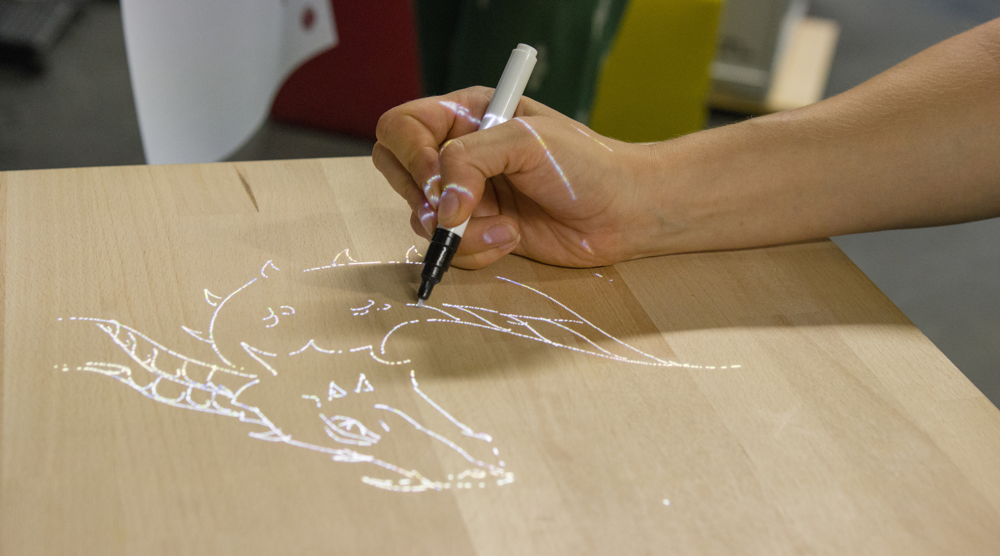
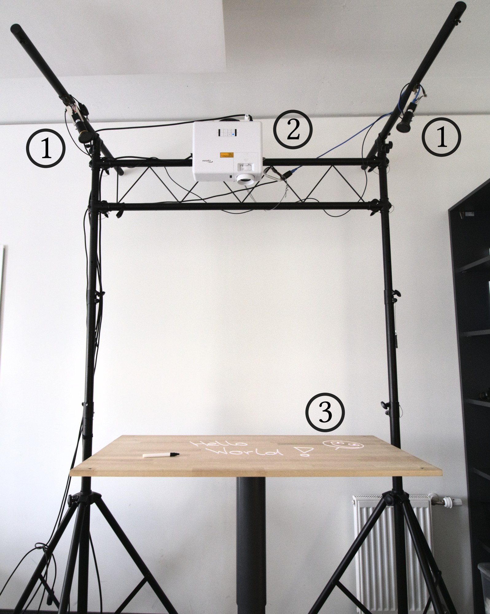

# Source code for TipTrack

Precise, low-latency, robust optical pen tracking on arbitrary surfaces
using an IR-emitting pen tip.


Figure 1: Drawing with the custom IR pen


To build your own setup, you will need a computer running Linux, a projector and one or more infrared sensitive cameras.
If the cameras still let light through in the visible spectrum, please use IR cutoff filters (in our case 850nm).

Our current setup uses two _FLIR BFS-U3-23S3M-C_ cameras ([Link](https://www.flir.eu/products/blackfly-s-usb3/?model=BFS-U3-23S3M-C)) with 850nm IR cutoff filters and an _Optoma UHZ50_ 4K projector ([Link](https://www.projectorcentral.com/Optoma-UHZ50.htm)).


Figure 2: Hardware setup (1: _FLIR BFS-U3-23S3M-C_ cameras, 2: _Optoma UHZ50_ 4K projector, 3: ordinary wooden tabletop)

# Step 1: Install dependencies

## Install Python dependencies:

```
pip3 install opencv-python
pip3 install scikit-image
pip3 install tensorflow
```

For Flir BlackFly S cameras: Install Spinnaker SDK and PySpin by following the official guide: https://www.flir.com/products/spinnaker-sdk/


## Install dependencies for SDL frontend (optional)

If you want to use our sample low latency drawing application:

```
sudo apt install libsdl2-gfx-dev
sudo apt install libsdl2-image-dev
sudo apt install libsdl2-ttf-dev
```


# Step 2: Setup and calibrate Projector and Cameras

Mount the projector in a way so that it projects onto a flat surface (e.g. a tabletop, see Figure 2). The cameras should be placed in a way so that they can see the entire projection surface.

To perform intrinsic camera calibration, run the script `TipTrack/intrinsic_camera_calibration/intrinsic_camera_calibration.py`.

You will need a checkerboard calibration pattern.

To perform a projector-camera-calibration, run the following script: `flir_blacklfy_s_calibration_tool.py`

The script will project a fullscreen white rectangle that fills the entire projection area. 
A preview of each camera's feed will appear. These windows will help you to adjust the cameras. Each camera needs to see the entire projection area.

Select the four corners of the projection area by clicking on them with your mouse cursor.
You won't be able to see the projector image with your infrared cameras. We use black tape to mark the four corner points. 

Each window will close after the four corners have been selected. A new calibration file called `config.ini` will appear in the project folder.

# Step 3: Run the application

If you want to use the pen as an Input device:

Give permission: `sudo chmod +0666 /dev/uinput`

Run the script, this will start everything: `python3 run_hid.py`

If you want to use our simple SDL drawing application instead, run:
`python3 main.py`


---

# Optional: Retrain the network

If the provided CNN file does not work for you, you can make your own.
Set `TRAINING_DATA_COLLECTION_MODE = True` in _main,py_. Now this script will save images.
Collect a few thousand images for drawing and a few thousand for hovering.

Then open the Jupyter Notebook _cnn/train_network.ipynb_ and update the path to your training data.
Run all cells. It will output a new CNN file that you need to reference in _TipTrack/pen_events/ir_pen_cnn.py_


